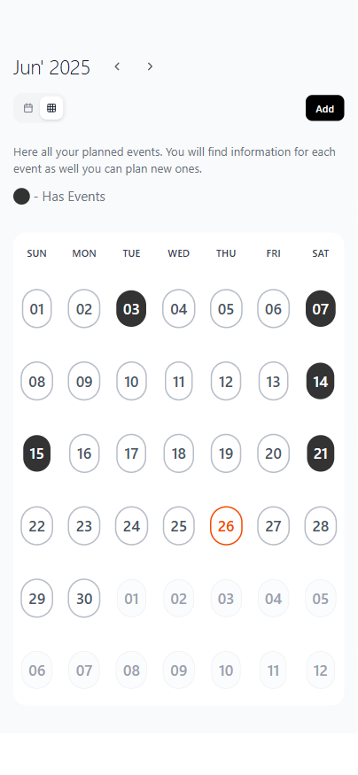
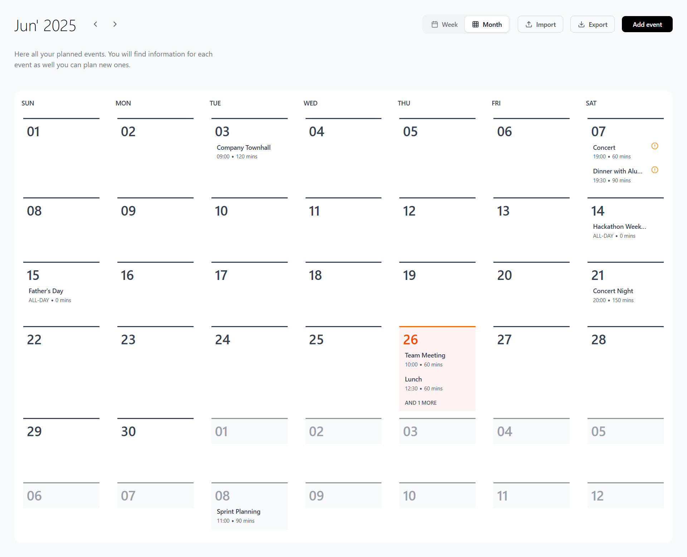

# Calendar App

A modern, responsive calendar application built with **React** and **Vite**. This app allows you to view, add, edit, delete, import, and export events in both monthly and weekly views. It features persistent storage, event conflict detection, and a clean, mobile-friendly UI.

### **Live Link:** [Click Here](https://ss-calendar.netlify.app/)

## Demo Outputs

<div style="width:100%;">


</div>

## Features

- **Monthly & Weekly Views:** Switch between month and week layouts.
- **Add/Edit/Delete Events:** Manage events with support for timed and all-day events.
- **Event Conflict Detection:** Visual indication of overlapping events.
- **Event Import/Export:** Import events from JSON and export all events to a JSON file.
- **Persistent Storage:** Events are saved in browser localStorage.
- **Responsive Design:** Optimized for both desktop and mobile devices.
- **Toasts & Dialogs:** User feedback via toast notifications and confirmation dialogs.
- **Sample Data:** Includes static sample events for demonstration.

## Getting Started

### Installation

```sh
git clone https://github.com/sanjithrk06/SurveySparrow-Calendar.git
cd SurveySparrow-Calendar
npm install
```

### Development

Start the development server:

```sh
npm run dev
```

Open [http://localhost:5173](http://localhost:5173) in your browser.

### Build

To build for production:

```sh
npm run build
```

## Project Structure

```
client-1/
├── public/
│   ├── calendar.png
│   └── vite.svg
├── src/
│   ├── App.jsx
│   ├── main.jsx
│   ├── index.css
│   ├── components/
│   ├── data/
│   ├── hooks/
│   ├── stores/
│   └── utils/
├── index.html
├── package.json
├── vite.config.js
└── README.md
```

## Import/Export Events

- **Import:** Use the "Import" button to paste a JSON with events. Validation and error reporting are provided.
- **Export:** Use the "Export" button to download all current events as a JSON file.

## Technologies Used

- [React](https://react.dev/)
- [Vite](https://vitejs.dev/)
- [Zustand](https://zustand-demo.pmnd.rs/) (state management)
- [Day.js](https://day.js.org/) (date utilities)
- [Tailwind CSS](https://tailwindcss.com/) (styling)
- [Lucide React](https://lucide.dev/) (icons)
- [react-hot-toast](https://react-hot-toast.com/) (toasts)

---
